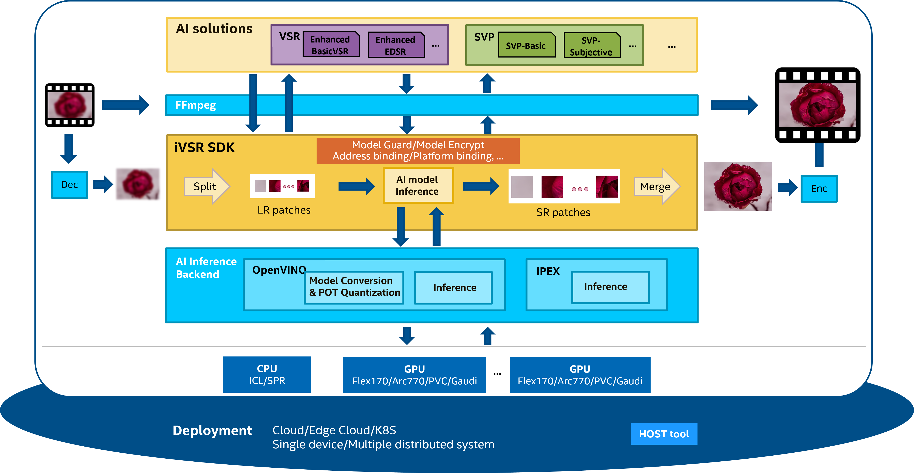

<!--  -->
<div align=center>

</div>

<div align=center>

[](https://api.securityscorecards.dev/projects/github.com/OpenVisualCloud/iVSR)
[](https://bestpractices.coreinfrastructure.org/projects/9795)
[](https://github.com/OpenVisualCloud/iVSR/actions/workflows/dependency-review.yml)
[](https://github.com/OpenVisualCloud/iVSR/actions/workflows/codeql.yml)<br>
[](https://github.com/OpenVisualCloud/iVSR/blob/master/LICENSE.md)
[](https://github.com/OpenVisualCloud/iVSR/wiki)
[](https://github.com/OpenVisualCloud/iVSR/actions/workflows/ubuntu-build-docker.yml)
[](https://github.com/OpenVisualCloud/iVSR/actions/workflows/trivy.yml)
</div>

# Contents Overview
1. [Overview of iVSR](#1-overview-of-ivsr)
    - [What is iVSR](#11-what-is-ivsr)
    - [Why is iVSR needed](#12-why-is-ivsr-needed)
    - [iVSR Components](#13-ivsr-components)
    - [Capabilities of iVSR](#14-capabilities-of-ivsr)
2. [Setup iVSR env on linux](#2-setup-ivsr-env-on-linux)
    - [Install GPU kernel packages(Optional)](#21-optional-install-gpu-kernel-packages)
    - [Install dependencies and build iVSR manually](#22-install-dependencies-and-build-ivsr-manually)
    - [Install dependencies and build iVSR by scripts](#23-install-dependencies-and-build-ivsr-by-scripts)
    - [Install dependencies and build iVSR by Dockerfile](#24-install-dependencies-and-build-ivsr-by-dockerfile)
3. [How to use iVSR](#3-how-to-use-ivsr)
    - [Run with iVSR SDK sample](#31-run-with-ivsr-sdk-sample)
    - [Run with FFmpeg](#32-run-with-ffmpeg)
4. [Model files](#4-model-files)
5. [License](#5-license)
# 1. Overview of iVSR
## 1.1 What is iVSR
iVSR aims to facilitate AI media processing with exceptional quality and performance on Intel's hardware.

iVSR offers a patch-based, heterogeneous, multi-GPU, and multi-algorithm solution, 
harnessing the full capabilities of Intel's CPUs and GPUs. 
And iVSR is adaptable for deployment on a single device, a distributed system, cloud infrastructure, edge cloud, or K8S environment.

<!--  -->
<div align=center>

</div>

## 1.2 Why is iVSR needed

- Simple APIs are provided, ensuring that any changes to the OpenVINO API remain hidden.
- A patch-based solution is offered to facilitate inference on hardware with limited memory capacity. This is particularly useful for super-resolution of high-resolution input videos, such as 4K.
- The iVSR SDK includes features to safeguard AI models created by Intel, which contain Intel IP.
- The iVSR SDK is versatile and can support a wide range of AI media processing algorithms.
- For specific algorithms, performance optimization can be executed to better align with customer requirements.

## 1.3 iVSR Components
This repository or package includes the following major components:

### 1.3.1 iVSR SDK
The iVSR SDK is a middleware library that supports various AI video processing filters. It is designed to accommodate different AI inference backends, although currently, it only supports OpenVINO.<br>
For a detailed introduction to the iVSR SDK API, please refer to [this introduction](./ivsr_sdk/README.md#api-introduction).We've also included a `vsr_sample` as a demonstration of its usage.<br>

### 1.3.2 iVSR FFmpeg plugin
In order to support the widely-used media processing solution FFmpeg, we've provided an iVSR SDK plugin to simplify integration.<br>
This plugin is integrated into FFmpeg's [`dnn_processing` filter](https://ffmpeg.org/ffmpeg-filters.html#dnn_005fprocessing-1) in the libavfilter library, serving as a new `ivsr` backend to this filter. Please note that the patches provided in this project are specifically for FFmpeg n6.1.<br>

### 1.3.3 OpenVINO patches and extension
In [this folder](./ivsr_ov/based_on_openvino_2022.3/patches), you'll find patches for OpenVINO that enable the Enhanced BasicVSR model. These patches utilize OpenVINO's [Custom OpenVINO™ Operations](https://docs.openvino.ai/latest/openvino_docs_Extensibility_UG_add_openvino_ops.html) feature, which allows users to support models with custom operations not inherently supported by OpenVINO.<br>
These patches are specifically for OpenVINO 2022.3, meaning the Enhanced BasicVSR model will only work on OpenVINO 2022.3 with these patches applied.<br>


## 1.4 Capabilities of iVSR
Currently, iVSR offers two AI media processing functionalities: Video Super Resolution (VSR), and Smart Video Processing (SVP) for bandwidth optimization. Both functionalities can be run on Intel CPUs and Intel GPUs (including Flex170, Arc770) via OpenVINO and FFmpeg.


### 1.4.1 Video Super Resolution (VSR)
Video Super Resolution (VSR) is a technique extensively employed in the AI media enhancement domain to upscale low-resolution videos to high-resolution. iVSR supports `Enhanced BasicVSR`, `Enhanced EDSR`, `TSENet`, and has the capability to be extended to support additional models.

- #### i. Enhanced BasicVSR
  `BasicVSR` is a publicly available AI-based VSR algorithm. For more details on the public `BasicVSR`, please refer to this [paper](https://arxiv.org/pdf/2012.02181.pdf).<br><br>
  We have improved the public model to attain superior visual quality and reduced computational complexity,  named `Enhanced BasicVSR`. The performance of the `Enhanced BasicVSR` model inference has also been optimized for Intel GPUs. Please note that this optimization is specific to OpenVINO 2022.3. Therefore, the Enhanced BasicVSR model only works with OpenVINO 2022.3 with the applied patches.<br><br>
  The input shape of this model is `[1, (channels)3, (frames)3, H, W]`, and the output shape is `[1, (channels)3, (frames)3, 2xH, 2xW]`.

- #### ii. Enhanced EDSR
  `EDSR` is another publicly available AI-based single image SR algorithm. For more details on the public EDSR, please refer to this [paper](https://arxiv.org/pdf/1707.02921.pdf)<br><br>
  We have improved the public `EDSR` model to reduce the computational complexity by over 79% compared to Enhanced BasicVSR, while maintaining similar visual quality, named `Enhanced EDSR`.<br><br>
  The input shape of this model is `[1, (channels)3, H, W]`, and the output shape is `[1, (channels)3, 2xH, 2xW]`.

- #### iii. TSENet
  `TSENet` is one multi-frame SR algorithm derived from [ETDS](https://github.com/ECNUSR/ETDS).<br><br>
  We provide a preview version of the feature to support this model in the SDK and its plugin. Please contact your Intel representative to obtain the model package.<br><br>
  The input shape of this model is `[1, (channels * frames)9, H, W]`, and the output shape is `[1, (channels)3, 2xH, 2xW]`. For each inference, the input data is the `(n-1)th`, `(n)th`, and `(n+1)th` frames combined. The output data is the `(N)th` frame. For the first frame, the input data is `1st`, `1st`, `2nd` frames combined. For the last frame, the input data is the `(n-1)th`, `(n)th`, `(n)th` frames combined.<br>

### 1.4.2. Smart Video Processing (SVP)
`SVP` is an AI-based video prefilter that enhances the perceptual rate-distortion in video encoding. With `SVP`, the encoded video streams maintain the same visual quality while reducing bandwidth.<br>

Two SVP model variances are provided. `SVP-Basic` model is one efficiency-oriented designed model, it preserves fidelity while reducing the encoded bitrate. Modifications to images/video by SVP-Basic pre-processing cannot be perceived by human eyes while they can be measured by no to minor BD-rates degradation if it’s measured by SSIM or MS-SSIM metrics. SVP-Basic model is adaptive to almost all video scenarios, including live sport, live gaming, livestream sales, VOD, video conference, video surveillance, and 5G video ring.<br>
`SVP-SE` model is designed for subjective video quality preservation with up to 50% bitrate saving. It targets human eyes plausible enhancement, reduces complex details like human-eyes insensitive patterns and noise; hence it can’t be evaluated by popular full-reference visual quality metrics including PSNR/SSIM/VMAF/etc. It improves the visibility and quality of visuals, making them more vivid and appealing to viewers, so it’s widely used in various industries, including entertainment, media and advertising, to enhance the visual experience and attract audience attention.<br><br>
The input and output shape are `[1, (channels)3, H, W]` for RGB based model and `[1, (channels)1, H, W]` for Y based model.<br>

# 2. Setup iVSR env on linux
The software was validated on:
- Intel Xeon hardware platform
- (Optional) Intel Data Center GPU Flex 170(*aka* ATS-M1 150W)
- Host OS: Linux based OS (Ubuntu 22.04 or Rocky Linux 9.3)
- Docker OS: Ubuntu 22.04 or Rocky Linux 9.3
- OpenVINO: [2022.3](https://github.com/openvinotoolkit/openvino/tree/2022.3.0) or [2023.2](https://github.com/openvinotoolkit/openvino/tree/2023.2.0) or [2024.5](https://github.com/openvinotoolkit/openvino/tree/2024.5.0)
- FFmpeg: [n6.1](https://github.com/FFmpeg/FFmpeg/tree/n6.1)

Building iVSR requires the installation of the GPU driver(optional), OpenCV, OpenVINO, and FFmpeg.<br>
We provide **three** ways to install requirements and build iVSR SDK & iVSR FFmpeg plugin:<br>
1. [Install dependencies and build iVSR manually](#22-install-dependencies-and-build-ivsr-manually)<br>
2. [Install dependencies and build iVSR by scripts](#23-install-dependencies-and-build-ivsr-by-scripts)<br>
3. [Install dependencies and build iVSR by Dockerfile](#24-install-dependencies-and-build-ivsr-by-dockerfile)<br>

Note that to run inference on a **GPU**, it is necessary to have **kernel packages** installed on the bare metal system beforehand. See [Install GPU kernel packages ](#21-optional-install-gpu-kernel-packages) for details.<br>

## 2.1 (Optional) Install GPU kernel packages
Refer to this [instruction](https://dgpu-docs.intel.com/driver/installation.html#ubuntu-package-installation) for the installation guide on Ubuntu. GPU runtime driver/packages are also installed in script and dockerfile provided.

## 2.2 Install dependencies and build iVSR manually

Here are two guides for your reference:<br>
One is generic in case you are familiar with Intel® devices and have experience in Intel® developed software before, which you can follow the official steps to build OpenCV and OpenVINO by source code. You can get it from: [Generic manual building guide](docs/generic_manual_build.md#generic-manual-build-steps-for-ffmpeg--ivsr-plugin-software)<br>
Another option is a tutorial for absolute beginners to try to build the project following every step in the guide based on a clean Ubuntu OS installed machine. [Quick manual building guide](docs/quick_try_manual_build.md#manual-build-steps-for-ffmpeg--ivsr-plugin-software-on-ubuntu)

## 2.3 Install dependencies and build iVSR by scripts
We provide shell scripts `build_ivsr.sh` and `ivsr_setupvar.sh` to assist in building the dependencies from source code and setting up the environment from scratch.<br>
```bash
#ivsr environment building
chmod a+x ./build_ivsr.sh
sudo ./build_ivsr.sh --enable_ov_patch <true/false> --enable_compile_ffmpeg true --ov_version <2022.3|2023.2|2024.5>
#environment variables setting
source ./ivsr_setupvar.sh --ov_version <2022.3|2023.2|2024.5>
```
The scripts accept the following input parameters:<br>
- `enable_ov_patch`: Determines whether to enable OpenVINO patches, which are necessary to run the Enhanced BasicVSR model.<br>
- `enable_compile_ffmpeg`: Determines whether to compile FFmpeg. Set this to `false` if you're only using the iVSR SDK sample.<br>
- `ov_version`: Specifies the OpenVINO version. iVSR supports `2022.3`, `2023.2` and `2024.5`. Note that running the Enhanced BasicVSR model requires `2022.3`.<br>

Feel free to modify and update these scripts as per your requirements. For new released OpenVINO version, please follow the [manual build](#22-install-dependencies-and-build-ivsr-manually) guide.<br>


## 2.4 Install dependencies and build iVSR by Dockerfile
Dockerfiles are also provided to expedite the environment setup process. Follow the guide to build the docker image and run the application in the docker containers: [Docker image build guide](docs/docker_image_build.md#docker-image-build-guide).<br>

# 3. How to use iVSR
Both `vsr_sample` and FFmpeg integration are provided to run inference on the iVSR SDK. Execute the following commands to setup the env before executing them. <br>
```bash
source <OpenVINO installation dir>/install/setupvars.sh
export LD_LIBRARY_PATH=<Package dir>/ivsr_sdk/lib:<OpenCV installation folder>/install/lib:$LD_LIBRARY_PATH
```
Please note that the current solution is of `pre-production` quality.<br>


## 3.1 Run with iVSR SDK sample
`vsr_sample` has been developed using the iVSR SDK and OpenCV. For guidance on how to run inference with it, please refer to this [section](./ivsr_sdk/README.md#vsr-sample).<br>

## 3.2 Run with FFmpeg
Once the FFmpeg plugin patches have been applied and FFmpeg has been built, you can refer to [the FFmpeg cmd line samples](ivsr_ffmpeg_plugin/README.md#how-to-run-inference-with-ffmpeg-plugin) for instructions on how to run inference with FFmpeg.<br>

# 4. Model files
Only models in OpenVINO IR format is supported by iVSR. Please reach out to your Intel representative to obtain the model files which are not included in the package.<br>


# 5. License
iVSR is licensed under the BSD 3-clause license. See [LICENSE](LICENSE.md) for details.

