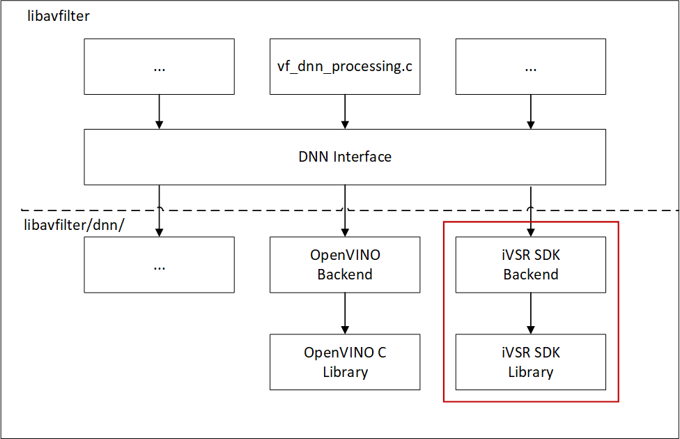

# iVSR FFmpeg plugin - iVSR SDK based
The folder `ivsr_ffmpeg_plugin` enables model inference using FFmpeg with iVSR SDK as backend. It provides additional `ivsr` backend for the DNN interface called by the `dnn_processing` filter.<br>
The patches included in `patches` folder are specifically for FFmpeg n6.1.<br>

<div align=center>

</div>

## How to run inference with FFmpeg-plugin
To run inference with iVSR SDK, you need to specify `ivsr` as the backend for the `dnn_processing` filter. Here is an example of how to do it: `dnn_processing=dnn_backend=ivsr`. <br>
Additionally, there are other parameters that you can use. These parameters are listed in the table below:<br>

|AVOption name|Description|Default value|Recommended value(s)|
|:--|:--|:--|:--|
|dnn_backend|DNN backend framework name|native|ivsr|
|model|path to model file|NULL|Available full path of the released model files|
|input|input name of the model|NULL|input|
|output|output name of the model|NULL|output|
|backend_configs:device|device for inference task|CPU|CPU or GPU|
|backend_configs:model_type|type for models|0|0 for Enhanced BasicVSR, 1 for SVP models, 2 for Enhanced EDSR, 3 for one CUSTOM VSR, 4 for TSENet|
|backend_configs:normalize_factor|factor for normalization|1.0|255.0 for Enhanced EDSR, 1.0 for other models supported in current version|
|backend_configs:extension|extension lib file full path, required for loading Enhanced BasicVSR model|
|backend_configs:op_xml|custom op xml file full path, required for loading Enhanced BasicVSR model|
|nif|number of input frames in batch sent to the DNN backend|1|3 for Enhanced BasicVSR, 1 for other models supported in current version|

Here are some examples of FFmpeg command lines to run inference with the supported models using the `ivsr` backend.<br>

- Command sample to run Enhanced BasicVSR inference, the input pixel format supported by the model is `bgr24`.
```
cd <iVSR project path>/ivsr_ffmpeg_plugin/ffmpeg
./ffmpeg -i <your test video> -vf format=bgr24,dnn_processing=dnn_backend=ivsr:model=<basic_vsr_model.xml>:input=input:output=output:nif=3:backend_configs='device=<CPU or GPU>&extension=<iVSR project path>/ivsr_ov/based_on_openvino_2022.3/openvino/bin/intel64/Release/libcustom_extension.so&op_xml=<iVSR project path>/ivsr_ov/based_on_openvino_2022.3/openvino/flow_warp_cl_kernel/flow_warp.xml' test_out.mp4
```
Please note that for the Enhanced BasicVSR model, you need to set the `extension` and `op_xml` options (with `backend_configs`) in the command line. After applying OpenVINO's patches and building OpenVINO, the extension lib file is located in `<OpenVINO folder>/openvino/bin/intel64/Release/libcustom_extension.so`, and the op xml file is located in `<OpenVINO folder>/openvino/flow_warp_cl_kernel/flow_warp.xml`.<br>

- Command sample to run SVP models inference
```
cd <iVSR project path>/ivsr_ffmpeg_plugin/ffmpeg
./ffmpeg -i <your test video> -vf format=bgr24,dnn_processing=dnn_backend=ivsr:model=<svp_model.xml>:input=input:output=output:nif=1:backend_configs='device=<CPU or GPU>&model_type=1' -pix_fmt yuv420p test_out.mp4
```
- Command sample to run Enhanced EDSR inference
```
cd <iVSR project path>/ivsr_ffmpeg_plugin/ffmpeg
./ffmpeg -i <your test video> -vf format=bgr24,dnn_processing=dnn_backend=ivsr:model=<edsr_model.xml>:input=input:output=output:nif=1:backend_configs='device=<CPU or GPU>&model_type=2&normalize_factor=255.0' -pix_fmt yuv420p test_out.mp4
```
- Command sample to run CUSTOM VSR inference. Note the input pixel format supported by this model is `yuv420p`.
```
cd <iVSR project path>/ivsr_ffmpeg_plugin/ffmpeg
./ffmpeg -i <your test video> -vf format=yuv420p,dnn_processing=dnn_backend=ivsr:model=<customvsr_model.xml>:input=input:output=output:nif=1:backend_configs='nireq=1&device=CPU&model_type=3' -pix_fmt yuv420p test_out.mp4
```
- Command sample to run TSENet model
```
cd <iVSR project path>/ivsr_ffmpeg_plugin/ffmpeg
./ffmpeg -i <your test video> -vf format=bgr24,dnn_processing=dnn_backend=ivsr:model=<tsenet_model.xml>:input=input:output=output:nif=1:backend_configs='device=<CPU or GPU>&model_type=4' -pix_fmt yuv420p test_out.mp4
```
