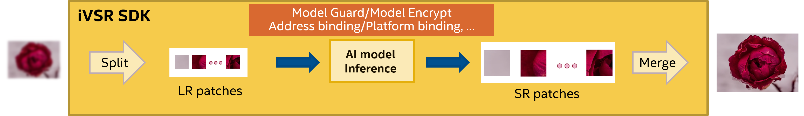

# Intel Video Super Resolution Development Kit


Intel Video Super Resolution Development Kit (iVSR SDK) is an SDK which is designed to support all kinds of AI media processing algorithms.

The SDK Core consists of two parts, one is the patch solution part, the other is the task scheduler part. 
1. The patch solution part will split the frames into small patches, then the small patch will be wrapped as one inference task and put it in the task queue in the scheduler module. In addition, each small patch will have a flag to indicate which platform will be used for inference.
1. The task scheduler part will fetch task from the task queue and send the task to the corresponding hardware according to the flag set for each small patch.

<br />

## **Feature Overview**

<!--  -->
<div align=center>

</div>

<br />

## **API Introduction**


The iVSR toolkit only provides API for C. All available interfaces are listed in the following table for [overview](#overview). 
Please refer to [Detailed Description](#detailed-description) for more information.


### **Overview**

|Function name|Operation|
|:--|:--|
|[ivsr_init](#ivsr_init)|Initialize the iVSR environment.|
|[ivsr_process](#ivsr_process)|Perform a VSR task.|
|[ivsr_reconfig](#ivsr_reconfig)|Reset and re-config iVSR environment. THIS API IS NOT WELL IMPLEMENTED YET.|
|[ivsr_get_attr](#ivsr_get_attr)|Get the iVSR properties/attributes.|
|[ivsr_deinit](#ivsr_deinit)|De-initialize the resources allocated for the iVSR environment.|


### **Detailed Description**


#### **ivsr_init**

Initialize the iVSR environment.

**Syntax**

```C 
IVSRStatus ivsr_init(ivsr_config_t *configs, ivsr_handle *handle); 
```
**Parameters**

- `configs` Configurations to initialize the intel VSR SDK. Including the following configurations:

    |Config name|Description|
    |:--|:--|
    |INPUT_MODEL|Required. Path to the input model file.|
    |TARGET_DEVICE|Required. Device to run the inference.|
    |CUSTOM_LIB|Optional. Path to extension lib file, required for loading Extended BasicVSR model|
    |CLDNN_CONFIG|Optional. Path to custom op xml file, required for loading Extended BasicVSR model|
    |PRECISION|Optional. To set inference precision for hardware|
    |RESHAPE_SETTINGS|Optional. To set reshape setting for the input model|
    |INPUT_RES|Required. To set input frame resolution in format `<width>,<height>`|
- `handle` A handle for VSR processing. 

**Description**

The method creates an iVSR handle to prepare VSR environment according to the configurations.

**Return Values**

 `IVSRStatus`	Return a status to indicate whether the initialization is successful or not. IVSRStatus is the enumeration type of return value for all iVSR APIs.
|Status name|Description|
|:--|:--|
|OK|Success.|
|GENERAL_ERROR|Get nullptr or return fail in functions.|
|UNKNOWN_ERROR|Unknown error|
|UNSUPPORTED_KEY|Unsupported key|
|UNSUPPORTED_CONFIG|Unsupported config value|
|EXCEPTION_ERROR|Catch a exception|
|UNSUPPORTED_SHAPE|Unsupported model shape|

#### **ivsr_process**

Perform a VSR task.

**Syntax**

```C
IVSRStatus ivsr_process(ivsr_handle handle, char* input_data, char* output_data, ivsr_cb_t* cb); 
```

**Parameters**

- `handle` A handle for VSR processing. 
- `input_data` Input data address for a VSR task, which points to the contents of input data obtained by user input.
- `output_data` Output data address for the VSR task output, which points to the output data buffer allocated according to model output shape.
- `cb` A callback function for user to know something about the VSR task, e.g. indicating whether the VSR task has completed.

**Description**

The method performs VSR processing with the given input data and generates the output data.

**Return Values**

`IVSRStatus`	Return a status to indicate whether VSR processing is successful or not.


#### **ivsr_reconfig**

Reset and re-config iVSR environment.

**Syntax**

```C
IVSRStatus ivsr_reconfig(ivsr_handle handle, ivsr_config_t* configs); 
```

**Parameters**

- `handle` A handle for VSR processing.
- `configs`  Configurations to reset the VSR environment.

**Description**

 The method reconfigures the VSR environment.

**Return Values**

`IVSRStatus`	Return a status to indicate whether reconfiguration is successful or not.


#### **ivsr_get_attr**

Get the iVSR properties/attributes.

**Syntax**

```C
IVSRStatus ivsr_get_attr(ivsr_handle handle, IVSRAttrKey key, void* value); 
```

**Parameters**

- `handle` A handle for VSR processing.  
- `key` Name of a attribute/property.
    |Key name|Description|
    |:--|:--|
    |IVSR_VERSION|Use this key to get ivsr version.|
    |INPUT_TENSOR_DESC|Use this key to get model input shape.|
    |OUTPUT_TENSOR_DESC|Use this key to get model output shape.|
    |NUM_INPUT_FRAMES|Use this key to get input frames number of the model.|
    |INPUT_DIMS|Use this key to get input dims of the model.|
    |OUTPUT_DIMS|Use this key to get input dims of the model.|
- `value` Value of the attribute got by key.

**Description**

This method is used to get the properties/attributes of the VSR environment that the user wants to know about.

**Return Values**

`IVSRStatus`	Return a status to indicate whether the attribute is gotten successfully.


#### **ivsr_deinit**

De-initialize the resources allocated for the iVSR environment.

**Syntax**

```C
IVSRStatus ivsr_deinit(ivsr_handle handle); 
```

**Parameters**

`handle` A handle for VSR processing.   

**Description**

The method deinitializes the handle and releases the resources allocated for iVSR process.


**Return Values**

`IVSRStatus`	Return a status to indicate whether VSR deinitialization is successful.

<br />

##  **VSR Sample**


There is a simple C++ sample to perform BasicVSR/EDSR/SVP inference on OpenVINO backend. You can reach the sample from `<iVSR project path>/ivsr_sdk/bin/vsr_sample`. You can get the help messages by running `./vsr_sample -h`  and see the default settings of parameters.

|Option name|Desciption|Default value|Recommended value(s)|
|:--|:--|:--|:--|
|h|Print Help Message|||
|cldnn_config|Required for GPU custom kernels. Absolute path to an .xml file with the kernels description.|None|for Extended BasicVSR, set &lt;Path to OpenVINO&gt;/flow_warp_custom_op/flow_warp.xml|
|data_path|Required. Input data path for inference.|None||
|device|Optional. Device to perform inference.|CPU|CPU or GPU or MULTI:GPU.0,GPU.1|
|extension|Optional. Extension (.so or .dll) path of custom operation.|None|path to libcustom_extension.so|
|model_path|Required. Path of VSR OpenVINO IR model (.xml).|None||
|nig|Optional. Number of input groups for inference.|1||
|save_path|Optional. Path to save predictions.|./outputs|If use the default value, make sure default path exists.|
|save_predictions|Optional. Whether to save the results to save_path.|false|If this option exists, results will be saved.|
|scale_factor|Optional. The ratio of the size of the image before scaling (original size) to the size of the image after scaling (new size).|2|For image enhancement model and if no resolution change, please set to 1.|
|normalize_factor|Optional. Normalization factor is equal to the value range required by models.|1.0|255.0 for Enhanced EDSR, 1.0 for other models.|
|precision |Required for inference precision setting, but runtime precision you need to check with your HW platform.|f32|f32[FP32], f16[FP16], bf16[bf16].|
|reshape_values|Optional. Reshape the network to fit the input image size. |None|Set the complete tensor value of the shape. e.g. --reshape_values="(1,3,720,1280)" in case your input image happens to be 1280x720 RGB 24bits|

Please note that all the paths specified by options should exist and do not end up with '/'. Here are some examples to run Enhanced BasicVSR/Enhanced EDSR/SVP models inference on different devices:

###  **Enhanced BasicVSR model Sample**

```bash
cd <iVSR project path>/ivsr_sdk/bin
# BasicVSR sample on CPU
./vsr_sample --model_path=[your BasicVSR model.xml] --data_path=[folder contains low resolution images] --extension=<iVSR project path>/ivsr_ov/based_on_openvino_2022.3/openvino/bin/intel64/Release/libcustom_extension.so --cldnn_config=<iVSR project path>/ivsr_ov/based_on_openvino_2022.3/openvino/flow_warp_cl_kernel/flow_warp.xml --nig=3 --device=CPU
# BasicVSR sample on Single GPU
./vsr_sample --model_path=[your BasicVSR model.xml] --data_path=[folder contains low resolution images] --extension=<iVSR project path>/ivsr_ov/based_on_openvino_2022.3/openvino/bin/intel64/Release/libcustom_extension.so --cldnn_config=<iVSR project path>/ivsr_ov/based_on_openvino_2022.3/openvino/flow_warp_cl_kernel/flow_warp.xml --nig=3 --device=GPU
# BasicVSR sample on Multiple-GPUs
./vsr_sample --model_path=[your BasicVSR model.xml] --data_path=[folder contains low resolution images] --extension=<iVSR project path>/ivsr_ov/based_on_openvino_2022.3/openvino/bin/intel64/Release/libcustom_extension.so --cldnn_config=<iVSR project path>/ivsr_ov/based_on_openvino_2022.3/openvino/flow_warp_cl_kernel/flow_warp.xml --nig=3 --device=MULTI:GPU.0,GPU.1
```
###  **Enhanced EDSR model Sample**
```bash
cd <iVSR project path>/ivsr_sdk/bin
./vsr_sample --model_path=[your EDSR model.xml] --data_path=[folder contains low resolution images]  --nig=1 --device=GPU  --normalize_factor=255.0 --precision=f16 #need to set normalize_factor as 225.0
```
### **SVP models Sample**
```bash
cd <iVSR project path>/ivsr_sdk/bin
./vsr_sample --model_path=[your SVP model.xml]--data_path=[folder contains input images]  --nig=1 --device=GPU --scale_factor=1 #need to set scale_factor as 1
```

No other models are supported with current version of VSR Sample.
<br />

